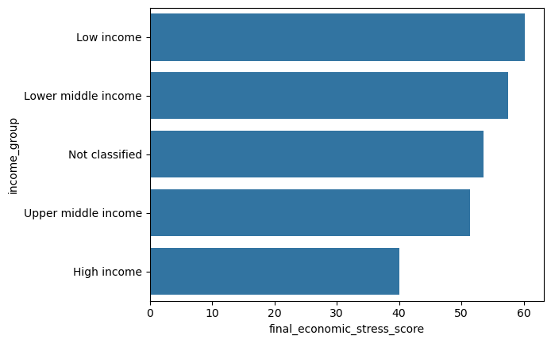
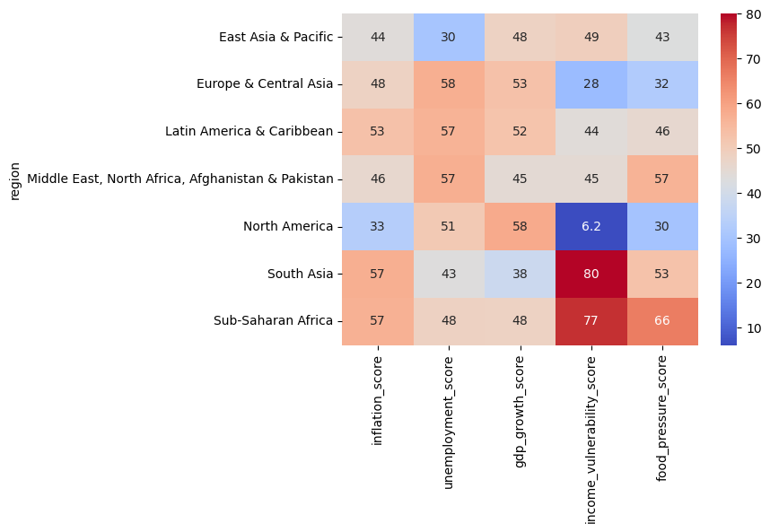
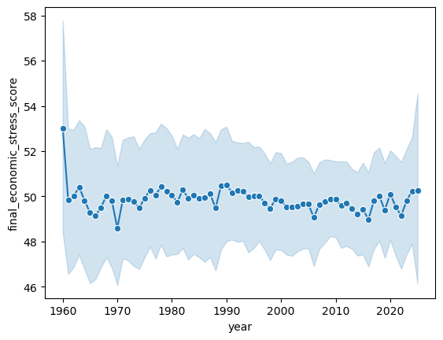

# Economic Stress Analysis

## Objective
Analyze economic stress across countries and identify the factors most strongly associated with high stress levels.

## Dataset Overview
- 14,322 records
- Multiple countries and regions
- Key features: `inflation_score`, `unemployment_score`, `gdp_growth_score`, `income_vulnerability_score`, `food_pressure_score`, `final_economic_stress_score`

## Key Findings

### 1. Inflation strongly correlates with economic stress

**Observation:**
Higher inflation scores are strongly associated with higher economic stress.

**Business Insight:**
Inflation appears to be one of the primary drivers of economic stress, making inflation mitigation an important policy lever.

### 2. Low-income countries face higher stress

**Observation:**
Low-income countries show the highest average economic stress scores, while high-income countries have lower stress levels.

**Business Insight:**
Economic vulnerability is concentrated in lower-income regions, suggesting that targeted support for these countries may reduce stress more effectively.

### 3. Food pressure is a major contributor

**Observation:**
Food pressure has one of the strongest positive correlations with final economic stress, especially in South Asia and Sub-Saharan Africa.

**Business Insight:**
Food security policies and nutrition support could meaningfully reduce economic stress in the most affected regions.

### 4. Regional stress differences are pronounced

**Observation:**
Sub-Saharan Africa and South Asia have the highest final economic stress scores among the regions analyzed.

**Business Insight:**
Regional interventions should prioritize those areas with the consistently highest stress scores.

### 5. Stress trends over time remain elevated

**Observation:**
Final economic stress has remained elevated over the time series, with only modest variation year to year.

**Business Insight:**
Long-term structural solutions are needed in addition to short-term relief to reduce sustained economic stress.

## Conclusion
- Inflation, food pressure, and income vulnerability are the strongest predictors of economic stress.
- Low-income countries are disproportionately affected by high stress.
- Sub-Saharan Africa and South Asia consistently report the highest stress levels.
- Policy action should focus on inflation control, food security, and support for vulnerable income groups.
